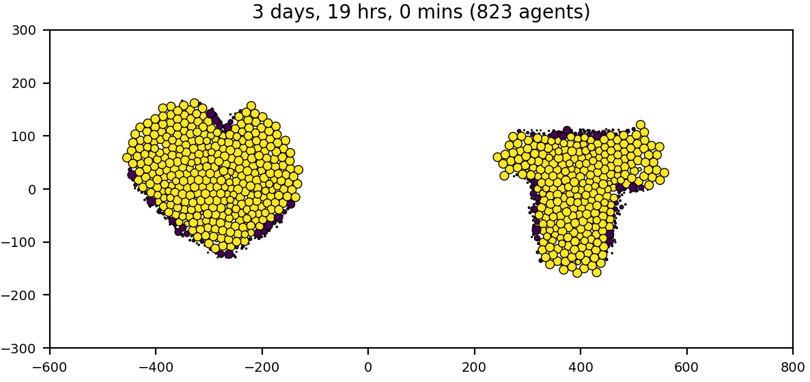
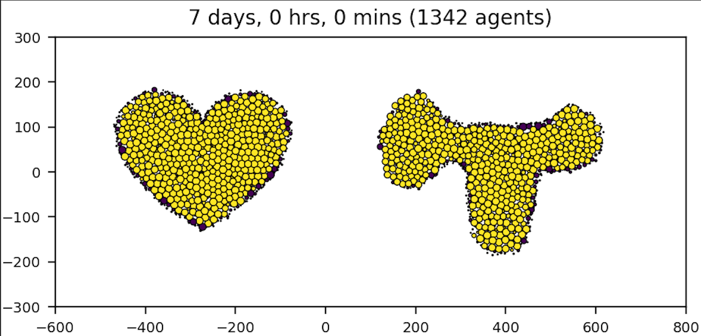
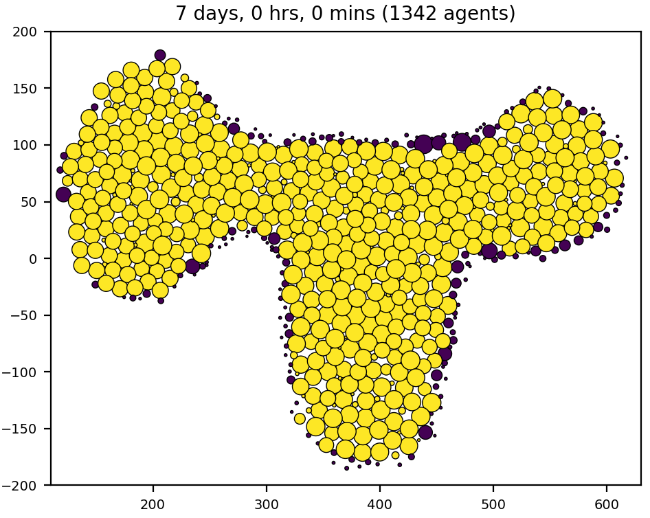

# region_fill

We've explored a few different ways to construct and/or fill ROIs with cells - both 2D and 3D, over the years. For the HuBMAP project, we were given .svg ROI geometries, whose boundaries were piecewise Bezier, and we ended up doing a scanline-style, hex-filled ROIs. And of course PhysiCell Studio offers simple hex-filled geometries also.

This repo demonstrates another simple approach to handling "voids" in a 2-D PhysiCell model. These voids may be coming from a segmented image or just a purely synthetic void. We assume a polygon can be provided that represents the void(s) boundary and a "centroid" cell (guaranteed to lie inside the polygon) for each void. We use PhysiCell to perform region-growing - starting with the centroid cell(s), proliferate, so long as daughter cells remain inside the polygon. When daughter cells step outside a void's polygonal boundary, they apoptose. At some point, either in post-processing or using another rule, we would want to make the cells, filling the voids, immovable (and experiment with their mechanical repulsion for additional cells that would be colliding with the void).

The next version of the model might be to fuse "inner" cells to reduce the number of cells.

```
# to generate a sample data set (polygons) from a synthetic image:
$ python polygon_boundaries3.py concave.png
```

To compile the initial model, in the 1.14.2 dir:
```
$ make load PROJ=region_fill__model0
$ make
$ project   # we used the Studio to render results
```


There's a cell custom data var called "inner": (yellow indicates it's inside its parent polygon; purple is outside)






